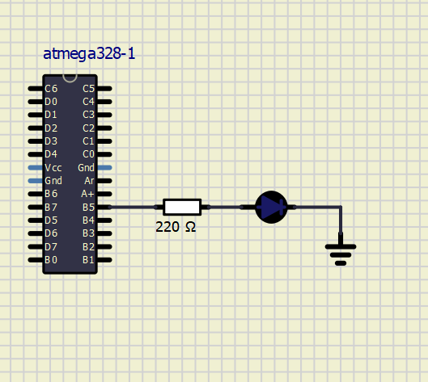

# 01-tools

## Binary operators

| **symbol** | **meaning** |
| :-: | :-: | 
| & | AND |
| \| | OR | 
| ^ | XOR | 
| ~ | NOT | 
| << | Binary left shift | 
| >> | Binary right shift | 


## Truth table
| **A** | **B** | **A & B** | **A \| B** | **A ^ B** | **~A** |
| :-: | :-: | :-: | :-: | :-: | :-: |
| 0 | 0 | 0 | 0 | 0 | 1 |
| 0 | 1 | 0 | 1 | 1 | 1 |
| 1 | 0 | 0 | 1 | 1 | 0 |
| 1 | 1 | 1 | 1 | 0 | 0 |

## Morse code

```c
```

## Scheme



