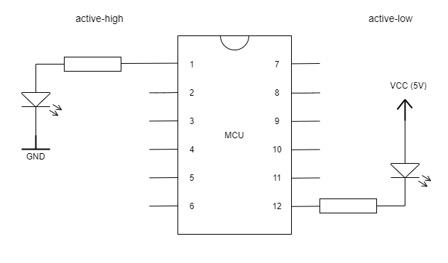
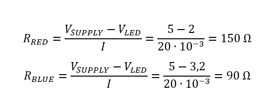
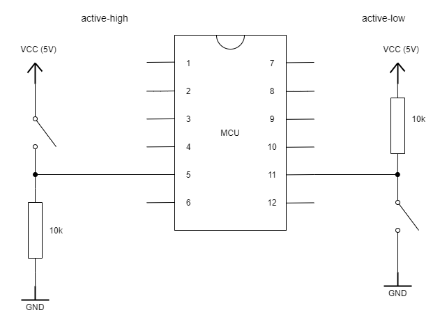

# Labs 2: DANIEL HAVRÁNEK
Link to your `Digital-electronics-2` GitHub repository:

(https://github.com/Dan5049/Digital-electronic-2)

## 1. Preparation tasks

1. Draw two basic ways to connect a LED to the output pin of the microcontroller: LED active-low, LED active-high.

2. Rezistor value calculation

| **LED color** | **Supply voltage** | **LED current** | **LED voltage** | **Rezistor value** | 
| :-: | :-: | :-: | :-: | :-: |
| red | 5 V | 20 mA | 2 V | 150 Ω|
| blue | 5 V | 20 mA | 3,2 V | 90 Ω |

3. Draw the basic ways to connect a push button to the microcontroller input pin: button active-low, button active-high.

