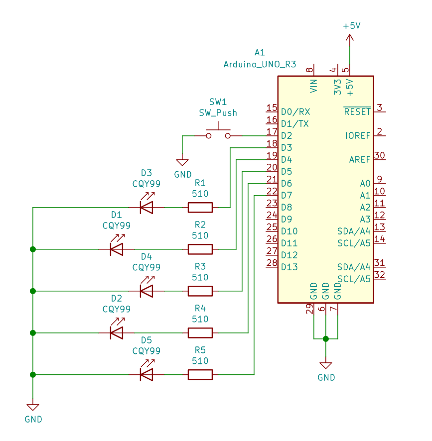

# Labs 2: DANIEL HAVRÁNEK
Link to your `Digital-electronics-2` GitHub repository:

(https://github.com/Dan5049/Digital-electronic-2)

### Active-low and active-high LEDs

1. Complete tables according to the AVR manual.

| **DDRB** | **Description** |
| :-: | :-- |
| 0 | Input pin |
| 1 | Output pin |

| **PORTB** | **Description** |
| :-: | :-- |
| 0 | Output low value |
| 1 | Output high value |

| **DDRB** | **PORTB** | **Direction** | **Internal pull-up resistor** | **Description** |
| :-: | :-: | :-: | :-: | :-- |
| 0 | 0 | input | no | Tri-state, high-impedance |
| 0 | 1 | input | yes | Pnx will source current if ext. pulled low |
| 1 | 0 | output | no | Output Low (Sink) |
| 1 | 1 | output | no | Output High (Source) |

2. Part of the C code listing with syntax highlighting, which blinks alternately with a pair of LEDs; let one LED is connected to port B and the other to port C:

```c
#define LED_GREEN   PB5     // AVR pin where green LED is connected
#define LED_RED     PC0     // AVR pin where red LED is connected
#define BLINK_DELAY 500
#ifndef F_CPU
# define F_CPU 16000000     // CPU frequency in Hz required for delay
#endif

#include <util/delay.h>     // Functions for busy-wait delay loops
#include <avr/io.h>         // AVR device-specific IO definitions
#include <avr/sfr_defs.h>   //button library i guess

{
    // Green LED at port B
    // Set pin as output in Data Direction Register...
    DDRB = DDRB | (1<<LED_GREEN);
    // ...and turn LED off in Data Register
    PORTB = PORTB & ~(1<<LED_GREEN);

    // Configure the second LED at port C
    DDRC = DDRC | (1<<LED_RED);
    PORTC = PORTC & ~(1<<LED_RED);
    
    while (1)
    {
        blinking leds
        _delay_ms(BLINK_DELAY);             //wait for red led
        PORTB = PORTB & ~(1<<LED_GREEN);    //turn on green led
        PORTC = PORTC & ~(1<<LED_RED);      //turn off red led
        _delay_ms(BLINK_DELAY);             //wait for green led
        PORTB = PORTB | (1<<LED_GREEN);     //turn off green led
        PORTC = PORTC | (1<<LED_RED);       //turn on red led
    }
    return 0;
}
```

### Push button

1. Part of the C code listing with syntax highlighting, which toggles LEDs only if push button is pressed. Otherwise, the value of the LEDs does not change. Let the push button is connected to port D:

```c
#define LED_GREEN   PB5     // AVR pin where green LED is connected
#define LED_RED     PC0     // AVR pin where red LED is connected
#define BTN         PD2     //AVR pin where button is connected
#define BLINK_DELAY 500
#ifndef F_CPU
# define F_CPU 16000000     // CPU frequency in Hz required for delay
#endif

#include <util/delay.h>     // Functions for busy-wait delay loops
#include <avr/io.h>         // AVR device-specific IO definitions
#include <avr/sfr_defs.h>   //button library i guess

int main(void)
{
    DDRB = DDRB | (1<<LED_GREEN);
    PORTB = PORTB & ~(1<<LED_GREEN);

    // Configure the second LED at port C
    DDRC = DDRC | (1<<LED_RED);
    PORTC = PORTC & ~(1<<LED_RED);

    // Configure Push button at port D and enable internal pull-up resistor
    DDRD = DDRD & ~(1<<BTN);
    PORTD = PORTD | (1<<BTN);
    

    // Infinite loop
    while (1)
    {
        if (bit_is_clear(PIND, PD2)){
            PORTB = PORTB ^ (1<<LED_GREEN);
            PORTC = PORTC ^ (1<<LED_RED);
            loop_until_bit_is_clear(PIND, BTN);
        }
    }
    return 0;
}
```

### Knight Rider

1. Scheme of Knight Rider application, i.e. connection of AVR device, five LEDs, resistors, one push button, and supply voltage. The image can be drawn on a computer or by hand. Always name all components and their values!

   
