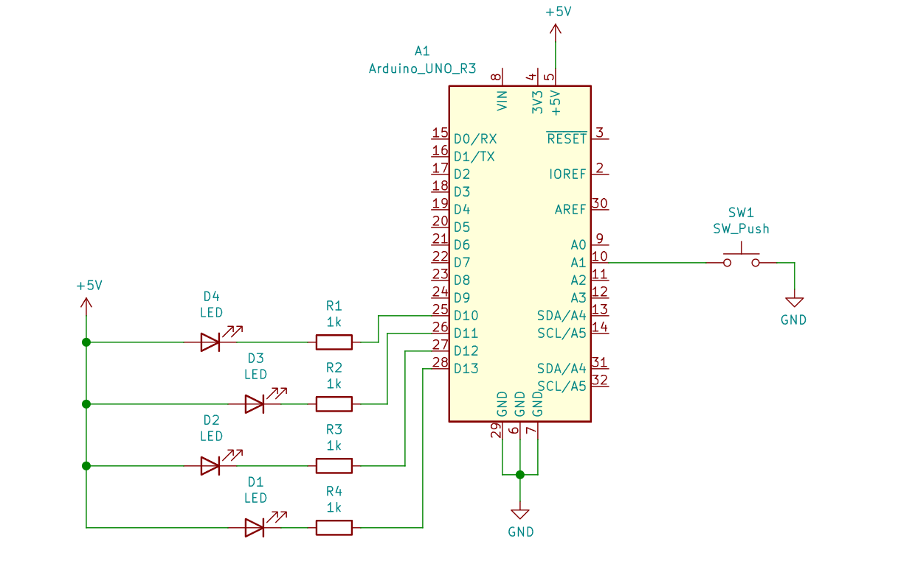

# Lab 4: DANIEL HAVRÁNEK

Link to your `Digital-electronics-2` GitHub repository:

https://github.com/Dan5049/Digital-electronic-2

### Overflow times

1. Complete table with overflow times.

| **Module** | **Number of bits** | **1** | **8** | **32** | **64** | **128** | **256** | **1024** |
| :-: | :-: | :-: | :-: | :-: | :-: | :-: | :-: | :-: |
| Timer/Counter0 | 8  | 16u | 128u | - | 1,024m | -- | 4,096m | 16,384m |
| Timer/Counter1 | 16 | 4,096m | 32,768m | - | 262,144m | -- | 1,048576 | 4,194304 |
| Timer/Counter2 | 8  | 16u | 128u | 512u | 1,024m | 2,048m | 4,096m | 16,384m |


### Timer library

1. In your words, describe the difference between common C function and interrupt service routine.
   * Function
   * Interrupt service routine

2. Part of the header file listing with syntax highlighting, which defines settings for Timer/Counter0:

```c
/**
 * @name  Definitions of Timer/Counter0
 * @note  F_CPU = 16 MHz
 */
// WRITE YOUR CODE HERE
```

3. Flowchart figure for function `main()` and interrupt service routine `ISR(TIMER1_OVF_vect)` of application that ensures the flashing of one LED in the timer interruption. When the button is pressed, the blinking is faster, when the button is released, it is slower. Use only a timer overflow and not a delay library.

   


### Knight Rider

1. Scheme of Knight Rider application with four LEDs and a push button, connected according to Multi-function shield. Connect AVR device, LEDs, resistors, push button, and supply voltage. The image can be drawn on a computer or by hand. Always name all components and their values!

   